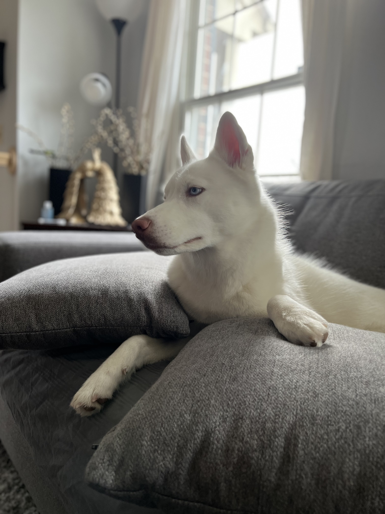

Author: Bids Ranjit
2/9/24 

# About my self 
___My name is Bids Ranjit. My real name is Bidwottam, I was born and raised in Nepal for 12 years. This is my second year at MC and I plan to transfer to UMD next school year.___ 

My hobbies are 
- Working with animals
- Physical activities such as 
  - Hiking
  - trekking 
- listening to music 

My bucket lists 
- [x] Jetskiing in Miami
- [ ] Skydiving
- [ ] Retire my parents
- [x] My own car
- [x] Own a VR set
- [ ] Make a stable income for a living 


I love music so here is a link to one my favorite music videos
[[https://www.example.com](https://youtu.be/2Vv-BfVoq4g?si=5bmlBgnbzMI66y9p)https://youtu.be/2Vv-BfVoq4g?si=5bmlBgnbzMI66y9p][1]

[1]: 


>> This is Polar. One of my main goals in life is to make this `husky` as happy as she can be. She is one of the few beings in my life who genuinely makes me happy and I will do everything in my power to give her the best life she deserves





# My hometown 
```
I was born in Kathmandu, Nepal. I lived
there for 12 years before My family, and I
moved to the United States. The city of
Kathmandu is a cultural and historical
treasure and the valley it sits in is
encircled by magnificent mountains. Its
winding, small alleyways are lined with
vibrant temples, lively markets, and the
friendly smiles of its locals.
```

| What I like about Maryland  | What I do not like about Maryland |
| --------------------------- |--------------------------------- 
|  Diversity                  |   The weather                     |
|  Locations for shopping     |   Not much tourist attractions    |


# My new year's resolutions and what i have accomplished so far
- [x] Only eat out twice a week, No more
- [x] Go to the gym at least 4 times a week
- [ ] Limit soda consumption
- [x] Get my parents a big gift for their 25th anniversary

One of my favorite quotes is 
>>> The more you know who you are, and what you want, the less you let things upset you.” —Stephanie Perkins


 How I feel about Data 110[^1].


[^1]: Overall I am enjoying my time in Data 110 so far. I like the way the professor teaches. He is very patient and an excellent teacher.


      

